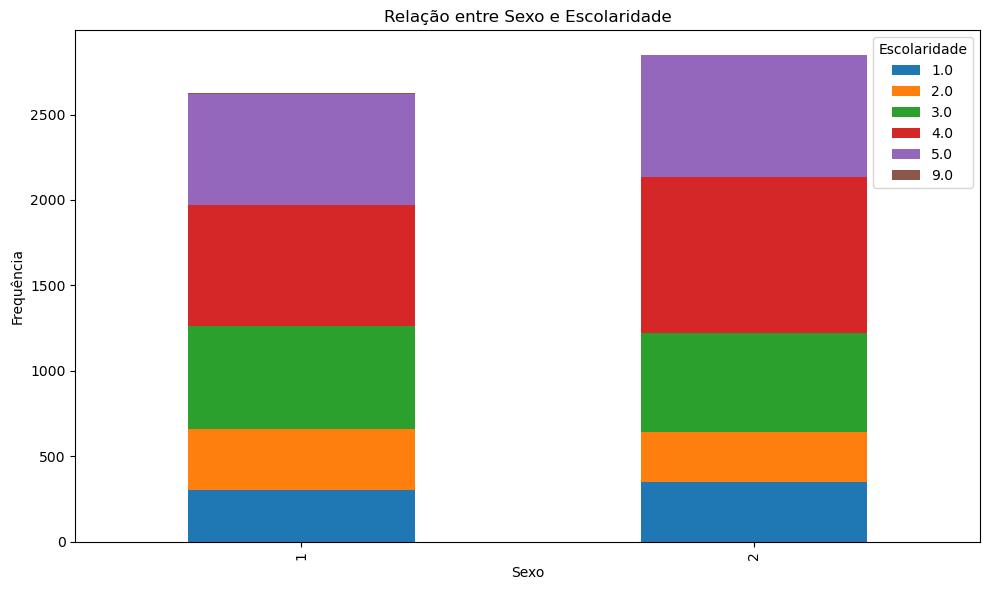
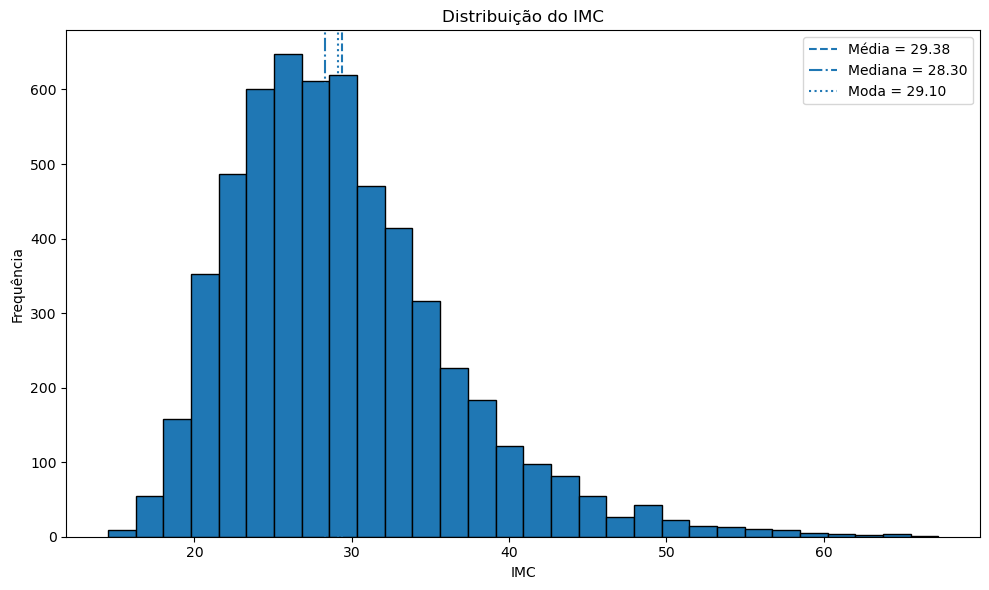
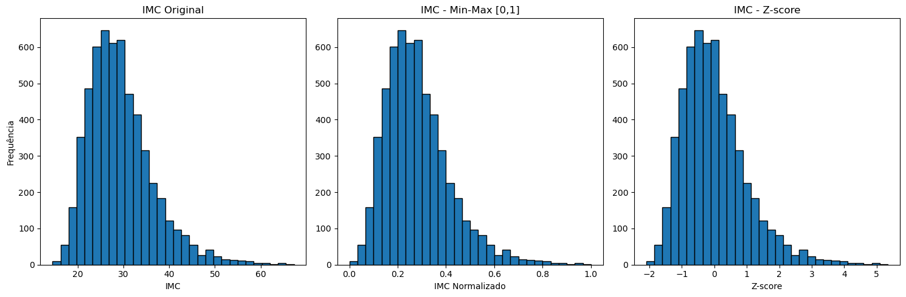
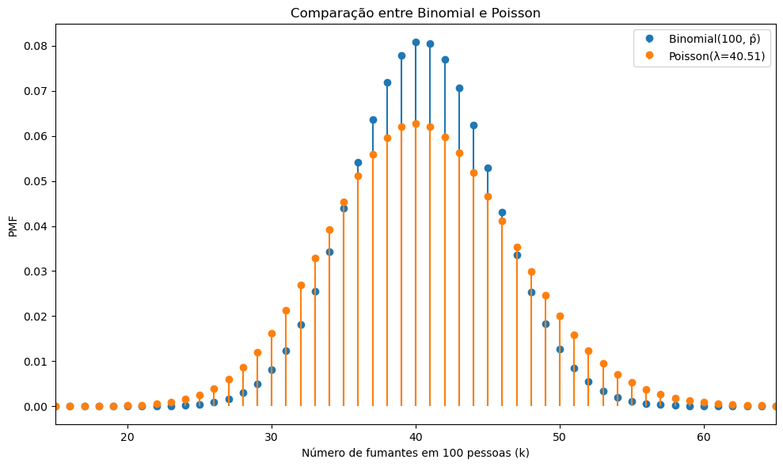
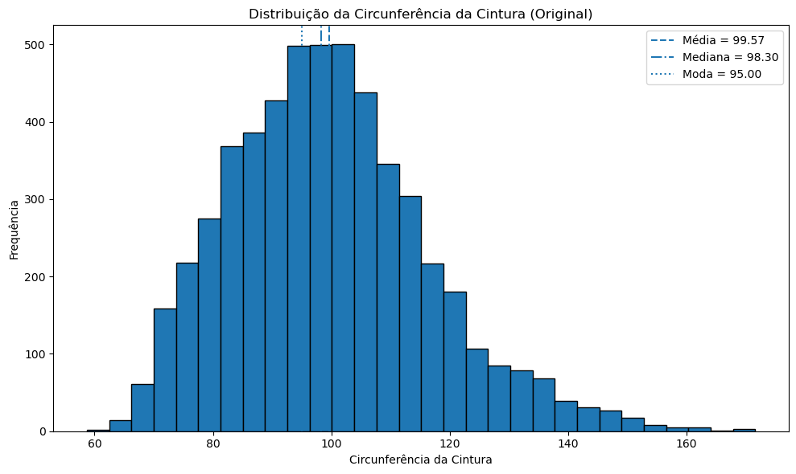

---

## 📷 Visualizações

### Relação entre Sexo e Escolaridade

### Distribuição do IMC

### Normalização Min-Max e Z-score

### Comparação entre Binomial e Poisson

### Normal vs Log-Normal

---

## 🛠 Tecnologias Utilizadas

- Python  
- Pandas  
- NumPy  
- Matplotlib  
- SciPy  
- Scikit-learn  
- Jupyter Notebook  

---

## 📄 Arquivos Gerados

- Notebook: `trabalho_estatistica_nhanes.ipynb`
- Relatório em PDF: `trabalho_estatistica_nhanes.pdf`
- Versão HTML: `trabalho_estatistica_nhanes.html`
